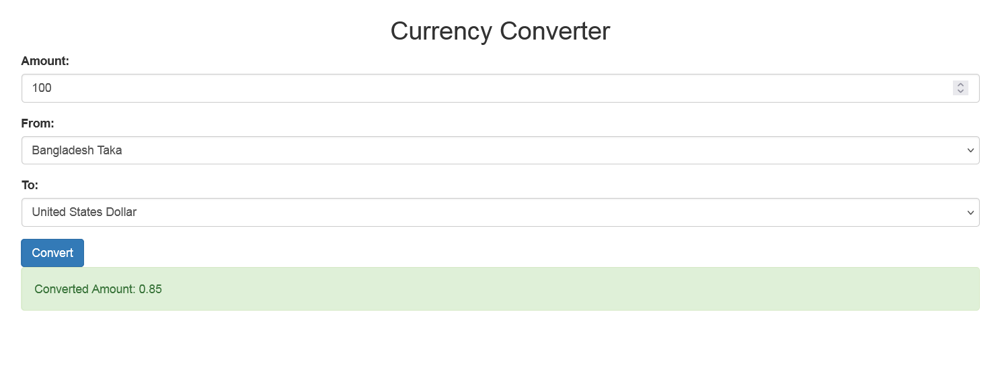

# simple-currency-converter

A PHP-based Currency Converter tool that allows users to convert currencies using real-time exchange rates fetched from an external API. The tool is built with PHP, HTML, jQuery, AJAX, JSON, Bootstrap, CSS, and MySQL. The application is designed to provide accurate currency conversion and display results in a user-friendly interface.

**Topics:** `php`, `mysql`, `blog`, `ajax`, `bootstrap`, `jquery`, `css`, `currency conversion`, `external api integration`, `api integration`



### Install Process

1. **Clone the repository:**
   ```sh
   git clone https://github.com/yourusername/simple-currency-converter.git
   ```

2. **Navigate to the project directory:**
   ```sh
   cd simple-currency-converter
   ```

3. **Set up the database:**
    - Create a MySQL database named `image_gallery`.
    - Import the provided SQL file to create the necessary table:
      ```sh
      mysql -u yourusername -p currency_converter < db/database.sql
      ```

4. **Update the database configuration:**
    - Copy `config.sample.php` to `config.php`:
       ```sh
       cp config.sample.php config.php
       ```
    - Open `config.php` and update the database configuration details.

5. **Setup API Integration:**
   - Obtain an API key from a currency exchange API provider (e.g., [ExchangeRate-API](https://www.exchangerate-api.com/)).
   - Update the `config.php` file with your API key and endpoint details.
   ```sh
   // API configuration
   define('API_URL', 'https://api.exchangerate-api.com/v4/latest/');
   define('API_KEY', 'your_api_key_here');
   ```

6. **Directory Permission:**
    - If you encounter permission issues, you might need to set more permissive permissions, such as chmod 777, which grants read, write, and execute permissions to everyone:
       ```sh
       chmod 777 assets/uploads
       ```
    - Open `config.php` and update the database configuration details.

7. **Start the development server:**
   ```sh
   php -S localhost:8000
   ```

8. **Access the application:**
    - Open your web browser and navigate to `http://localhost:8000`.


### File Structure

Here’s a basic file structure for your simple-currency-converter application:

```
simple-currency-converter/
│
├── index.html
├── db/
│   └── database.sql
├── include/
│   ├── config.sample.php
│   └── db.php
├── assets/
│   ├── css/
│   │   └── style.css
│   └── js/
│   │   └── script.js
├── src/
│   ├── fetch-rates.php
│   ├── convert.php
│   └── get-currencies.php
├── README.md
└── .gitignore
```
